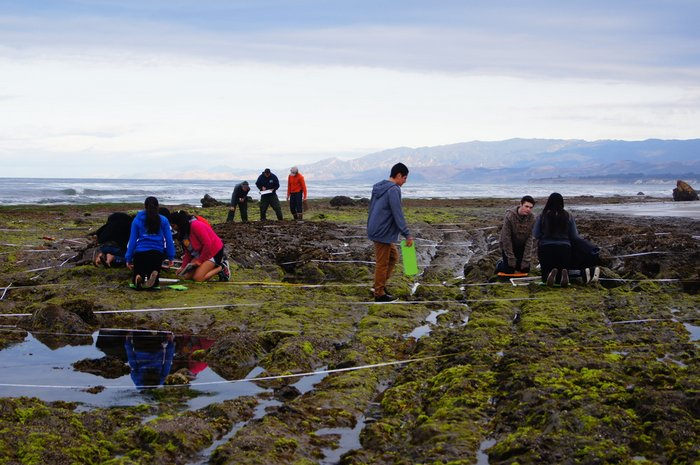
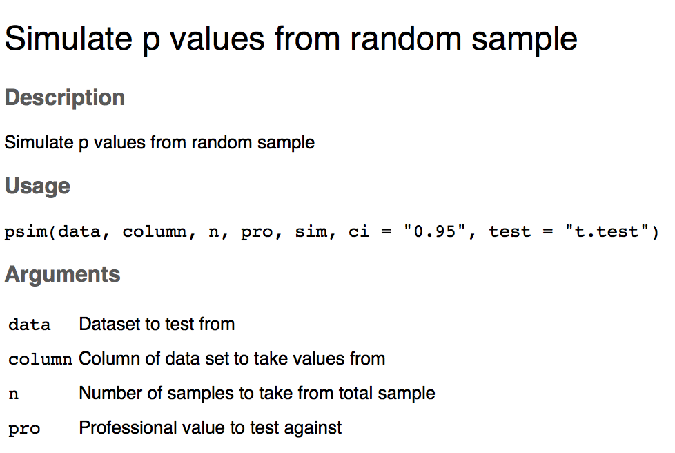
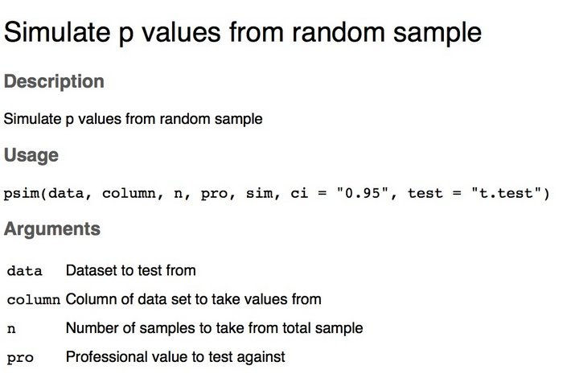

##Significance |Our Presentation Goals {.build} 

- Data discovery

- Important and informative infographics

- Pertinent packages

----
<center>

</center>
----
<center>

</center>

----
<center>

</center>

##Significance |Our Presentation Goals
- Data discovery

- Important and informative infographics

- Pertinent packages

##El Nino and Octopus Landings
```{r}
Octo <- read.csv("./Data/OctoLanding.csv")
test<- Octo %>% 
  gather("fishery", "catch", 2:4) %>% 
  filter(fishery!="Total.Landings")

octo_plot<- ggplot(test, aes(x=Year, y=catch)) +
  geom_point(aes(color=fishery, size=ONI)) +
  theme_classic() +
  ggtitle("Octopus Landings from 1980-2014") +
  labs(x="Year", y="Octopus landings (tons)") +
  scale_color_manual(values= c("darkblue", "lightblue")) +
  theme(legend.position = "bottom")

octo_plot

```

##El Nino and Octopus Landings
```{r Octopus, echo=FALSE, message=FALSE, warning= FALSE}
library(readr)
library(dplyr)
library(tidyr)
library(ggplot2)
library(shiny)


Octo1 = read_csv("./wk08_shiny/OctoLanding.csv")      

octo <- Octo1[, 1:6] %>% 
  gather("fishery", "catch", 2:4) %>% 
  filter(fishery!="Total.Landings") 

# Define UI for application
ui <- fluidPage(
   # Application title
   titlePanel("Octopus Landings"),
   sidebarLayout(
      sidebarPanel(
        # Creates the slider for the date range
         sliderInput("range",
                     "Date Range:",
                     min = 1980,max = 2013,
                     value = c(1980,2013),
                     sep="")
      ),
      # Below is the section that creates the checkbox widget (to select Pacific, Caribbean, or both)
      checkboxGroupInput("checkGroup", 
                         label = h3("Select Index"),
                         choices = list("Normal" = 1, "El Nino" = 2, "La Nina" = 3),
                         selected = 1)
   ),
      # Show the scatter plot of catch data in the main panel
      mainPanel(
         plotOutput("distPlot"),
         br(), br(),
         tableOutput("results")
      )
   )

 
 # Define server logic required to plot octopus landings
 server <- shinyServer(function(input, output) {
   # Create output plot
   # **** Right now the display part ALMOST works. The plot doesn't display at all unless the La Nina box is checked, in which case that will display correctly. I'm not sure if this is to do with the way that the ggplot stuff is set up (like we need to initialize the plot outside an if statement?) or because it's the last item?******
   output$distPlot <- renderPlot({

     if (1 %in% input$checkGroup) {
       ggplot(subset(octo, ONI == "Normal")) +
         aes(x=Year, y=catch) +
         geom_point(aes(color=fishery, size=ONI)) +
         xlim(input$range[1],input$range[2]) +
         theme_classic() +
         ggtitle("Octopus Landings") +
         labs(x="Year", y="Octopus landings (tons)") +
         theme(legend.position = "bottom")
     }

     if (2 %in% input$checkGroup) {
       ggplot(subset(octo, ONI == "Nino")) +
        aes(x=Year, y=catch) +
        geom_point(aes(color=fishery, size=ONI)) +
        xlim(input$range[1],input$range[2]) +
        theme_classic() +
        ggtitle("Octopus Landings") +
        labs(x="Year", y="Octopus landings (tons)") +
        theme(legend.position = "bottom")
     }

     if (3 %in% input$checkGroup) {
      ggplot(subset(octo, ONI == "Nina")) +
      aes(x=Year, y=catch) +
      geom_point(aes(color=fishery, size=ONI)) +
      xlim(input$range[1],input$range[2]) +
      theme_classic() +
      ggtitle("Octopus Landings") +
      labs(x="Year", y="Octopus landings (tons)") +
      theme(legend.position = "bottom")
      }
      })
   })
 
  # Run the application 
shinyApp(ui = ui, server = server)


```

##Code Failure
```{r Code, eval=FALSE, echo=TRUE}
# Define UI for application
ui <- fluidPage(
   # Application title
   titlePanel("Octopus Landings"),
   sidebarLayout(
      sidebarPanel(
        # Creates the slider for the date range
         sliderInput("range",
                     "Date Range:",
                     min = 1980,max = 2013,
                     value = c(1980,2013),
                     sep="")
      ),
      # Below is the section that creates the checkbox widget (to select Pacific, Caribbean, or both)
      checkboxGroupInput("checkGroup", 
                         label = h3("Select Index"),
                         choices = list("Normal" = 1, "El Nino" = 2, "La Nina" = 3),
                         selected = 1)
   ),
      # Show the scatter plot of catch data in the main panel
      mainPanel(
         plotOutput("distPlot"),
         br(), br(),
         tableOutput("results")
      )
   )

 
 # Define server logic required to plot octopus landings
 server <- shinyServer(function(input, output) {
   # Create output plot
   # **** Right now the display part ALMOST works. The plot doesn't display at all unless the La Nina box is checked, in which case that will display correctly. I'm not sure if this is to do with the way that the ggplot stuff is set up (like we need to initialize the plot outside an if statement?) or because it's the last item?******
   output$distPlot <- renderPlot({

     if (1 %in% input$checkGroup) {
       ggplot(subset(octo, ONI == "Normal")) +
         aes(x=Year, y=catch) +
         geom_point(aes(color=fishery, size=ONI)) +
         xlim(input$range[1],input$range[2]) +
         theme_classic() +
         ggtitle("Octopus Landings") +
         labs(x="Year", y="Octopus landings (tons)") +
         theme(legend.position = "bottom")
     }

     if (2 %in% input$checkGroup) {
       ggplot(subset(octo, ONI == "Nino")) +
        aes(x=Year, y=catch) +
        geom_point(aes(color=fishery, size=ONI)) +
        xlim(input$range[1],input$range[2]) +
        theme_classic() +
        ggtitle("Octopus Landings") +
        labs(x="Year", y="Octopus landings (tons)") +
        theme(legend.position = "bottom")
     }

     if (3 %in% input$checkGroup) {
      ggplot(subset(octo, ONI == "Nina")) +
      aes(x=Year, y=catch) +
      geom_point(aes(color=fishery, size=ONI)) +
      xlim(input$range[1],input$range[2]) +
      theme_classic() +
      ggtitle("Octopus Landings") +
      labs(x="Year", y="Octopus landings (tons)") +
      theme(legend.position = "bottom")
      }
      })
   })
 
  # Run the application 
shinyApp(ui = ui, server = server)

```


```{r setup, include=TRUE}
```

## South Coast Water Production

```{r, include = FALSE}
library(streamgraph)
library(readr)
library(tidyr)
library(dplyr)

watersup = read_csv("./Data/watersup.csv")
watersup$Date = as.Date(watersup$Date, format = "%Y-%m-%d")

watersup %>%
  gather(source, AF, SWP:Recycled) %>%
  streamgraph("source","AF","Date") %>%
  sg_axis_x(1, "Date", "%Y") %>%
  sg_legend(show=TRUE, label="Sources: ") -> SCwater

#South Coast Water Production by Year (1998-2014)
SCwater
```

```{r SC Water, echo = FALSE}
SCwater
```

## Sankey Diagram - Water Supply

```{r sankey test, include=FALSE}
library(dplyr)
library(readr)
library(networkD3)
nodes = read_csv("./Data/p1.csv") %>%
  as.data.frame()

links = read_csv("./Data/p2.csv") %>%
  filter(Value!=0) %>% ##not equal to 0 
  # sankey links numbering needs to start at 0
  mutate(
    Source = Source - 1,
    Target = Target - 1) %>%
  as.data.frame()

sankeyNetwork(
  Links = links, Nodes = nodes, Source = "Source",
  Target = "Target", Value = "Value", NodeID = "name",
  units = "AF", fontSize = 12, nodeWidth = 30) -> SCsankey
```

```{r Sankey Slide, echo = FALSE}
SCsankey
```

## THE package

```{r Data, echo=FALSE, eval=T}
suppressWarnings(library(dplyr))
suppressWarnings(library(knitr))
CSData <- read.csv("./Data/CSData.csv")

Data <- select(CSData,Target)
```



```{r psim, echo = TRUE, fig.width= 6, fig.height=6, eval=T}
library(devtools)
library(psim)
#install_github("jepa/jepa.github.io", subdir = "psim")
```

<<<<<<< HEAD
## THE package (2)

```{r psim function 1, echo = TRUE, eval=FALSE}

# psim <- function(data,column,n,pro,sim,ci="0.95",test="t.test"){
#   suppressWarnings(library(dplyr))
# # Creates the matrix for x #
#   x <- data.frame(matrix(nrow = n, ncol=sim))
# 
# #Loops trought the matrix to get random numbers of samplings within the n scorring world
#   for (i in 1:sim){
#     #x[i] = sample(data[[column]],n)
#     x[i] = sample(data[,column],n)
#   }

```

## THE package (3)

```{r psim function 2, echo=T}
# # Runs a parametric t.test  for each combination of n with 0.95 CI
#   if (test == "t.test" & ci == "0.95"){
# 
#     Score<- apply(x, 2, t.test, alternative = "two.sided",mu = pro, paired = FALSE, var.equal = FALSE, conf.level = 0.95)
# 
#   } #If test = t.test CI 0.95
# 
# # Runs a parametric t.test  for each combination of n with 0.90 CI
#   if (test == "t.test" & ci == "0.90"){
# 
#     Score<- apply(x, 2, t.test, alternative = "two.sided",mu = pro, paired = FALSE, var.equal = FALSE, conf.level = 0.90)
# 
#   } #If test = t.test CI 90

```

## THE package (4)

```{r, last part function, eval=T, echo=T}
  ##### Presenting results ####

  # Significant <- filter(PvalTable, Value <= 0.05)
  # NoSignificant <- filter(PvalTable, Value > 0.05)
  # 
  # Final <- data.frame(length(Significant$Value),length(NoSignificant$Value))
  # colnames(Final) <- c("Significant","No_significant")
  # 
  # return(Final)
# }
```
=======


```{r Function, echo=FALSE, warning=FALSE,message=FALSE, eval=T}
library(devtools)
#install_github("jepa/jepa.github.io", subdir = "psim")
library(psim)
column= 1
CSs = 2
pro = 66
simulations = 1000
test="w.test"

Cs2<- psim(data=Data,column=column,n=2,pro=pro,sim=simulations,test=test)
Cs3<- psim(data=Data,column=column,n=3,pro=pro,sim=simulations,test=test)
Cs4<- psim(data=Data,column=column,n=4,pro=pro,sim=simulations,test=test)
Cs5<- psim(data=Data,column=column,n=5,pro=pro,sim=simulations,test=test)
Cs6<- psim(data=Data,column=column,n=6,pro=pro,sim=simulations,test=test)
Cs7<- psim(data=Data,column=column,n=7,pro=pro,sim=simulations,test=test)
Cs8<- psim(data=Data,column=column,n=8,pro=pro,sim=simulations,test=test)
Cs9<- psim(data=Data,column=column,n=9,pro=pro,sim=simulations,test=test)
Cs10<- psim(data=Data,column=column,n=10,pro=pro,sim=simulations,test=test)


FinalResults<- matrix(c(Cs2$Significant,Cs3$Significant,Cs4$Significant,Cs5$Significant,Cs6$Significant,Cs7$Significant,Cs8$Significant,Cs9$Significant,Cs10$Significant,Cs2$No_significant,Cs3$No_significant,Cs4$No_significant,Cs5$No_significant,Cs6$No_significant,Cs7$No_significant,Cs8$No_significant,Cs9$No_significant,Cs10$No_significant), ncol=2)
#head(FinalResults)

colnames(FinalResults) <- c("Significant","No Significant")
rownames(FinalResults) <- c("Cs2","Cs3","Cs4","Cs5","Cs6","Cs7","Cs8","Cs9","Cs10")
FinalResults <- kable(FinalResults)
```

## Psim Example 

```{r Kable, fig.width= 6, fig.height=6, eval=T}
FinalResults
```
