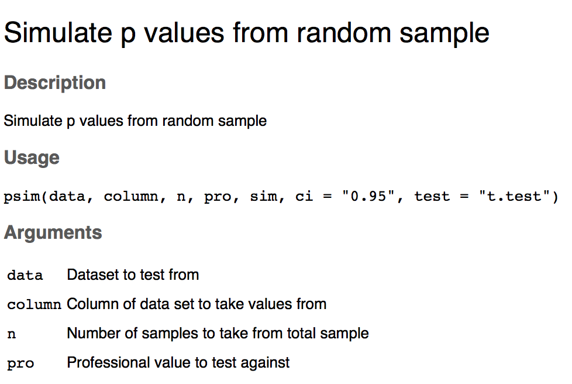

## THE package

```{r Data, echo=FALSE, eval=T}
suppressWarnings(library(dplyr))
suppressWarnings(library(knitr))
CSData <- read.csv("./Data/CSData.csv")

Data <- select(CSData,Target)
```



```{r psim, echo = TRUE, fig.width= 6, fig.height=6, eval=T}
library(devtools)
library(psim)
install_github("jepa/jepa.github.io", subdir = "psim")
```

<<<<<<< HEAD
## THE package (2)

```{r psim function 1, echo = TRUE, eval=FALSE}

# psim <- function(data,column,n,pro,sim,ci="0.95",test="t.test"){
#   suppressWarnings(library(dplyr))
# # Creates the matrix for x #
#   x <- data.frame(matrix(nrow = n, ncol=sim))
# 
# #Loops trought the matrix to get random numbers of samplings within the n scorring world
#   for (i in 1:sim){
#     #x[i] = sample(data[[column]],n)
#     x[i] = sample(data[,column],n)
#   }

```

## THE package (3)

```{r psim function 2, echo=T}
# # Runs a parametric t.test  for each combination of n with 0.95 CI
#   if (test == "t.test" & ci == "0.95"){
# 
#     Score<- apply(x, 2, t.test, alternative = "two.sided",mu = pro, paired = FALSE, var.equal = FALSE, conf.level = 0.95)
# 
#   } #If test = t.test CI 0.95
# 
# # Runs a parametric t.test  for each combination of n with 0.90 CI
#   if (test == "t.test" & ci == "0.90"){
# 
#     Score<- apply(x, 2, t.test, alternative = "two.sided",mu = pro, paired = FALSE, var.equal = FALSE, conf.level = 0.90)
# 
#   } #If test = t.test CI 90

```

## THE package (4)

```{r, last part function, eval=T, echo=T}
  ##### Presenting results ####

  # Significant <- filter(PvalTable, Value <= 0.05)
  # NoSignificant <- filter(PvalTable, Value > 0.05)
  # 
  # Final <- data.frame(length(Significant$Value),length(NoSignificant$Value))
  # colnames(Final) <- c("Significant","No_significant")
  # 
  # return(Final)
# }
```