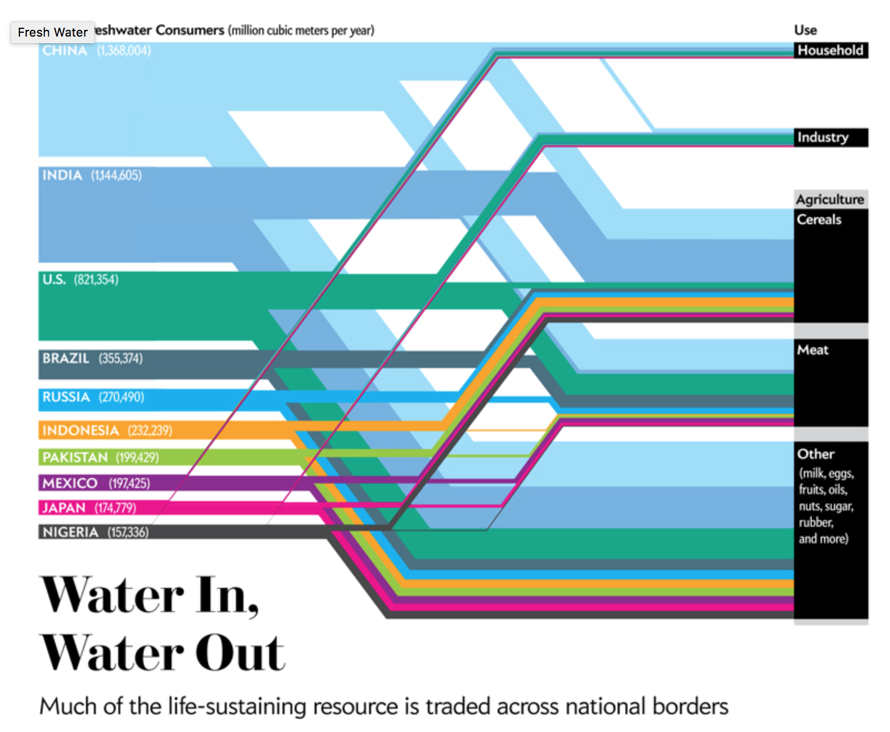

# Introduction

Our team worked with two datasets that we had readily available. We wanted to create informative graphics that helped best display our data and analyses. We also created a package to run random t-tests on datasets. First, we worked with data from octopus fisheries. We examined this data to visualize the size of catches in different fishery locations (Pacific and Caribbean) and during different climatic events (El Nino and La Nina). We also worked with local water supply data from a group project. The client for this project is eager to have this information displayed in accessible and informative ways. We incorporated this objective into our project, along with the fishery data and package.

# Innovative Examples of Communication
### Water
We were inspired by Jen Christiansen's visualization of water use patterns throughout the world. This is a simple and elegant visualization of water use internationally and the fate of those water supplies.
View at [Jen Christiansen's website](http://jenchristiansen.com/?p=20).


### Fisheries
A great example of fisheries data visualization can be found at [Sea Around Us](http://www.seaaroundus.org/data/#/spatial-catch). The user can select various countries, pick the category in which they want catches to be grouped, and select one or multiple taxa to map. Users can also manipulate the year. This approach makes for a user interface that allows a high degree of customization, but is still clean enough not to overwhelm the user.

### Climate
NASA's [Climate Time Machine](http://climate.nasa.gov/climate_resources/25/) allows users to view changes in several climate variables over time (sea ice, sea level, carbon emissions, and average global temperature). They incorporate maps and time sliders to provide at-a-glance information about where these impacts are being felt most severely. 

# Methods

For visualizations, we generally followed methods outlined in class examples and used various r packages (including readr, dplyr, and ggplot).

Water supply data came from five local water districts, and was provided as part of one of our group members' group projects (see references). This supply data consists of monthly water volume delivered to each district from each water source. For the streamgraph, data was aggregated across districts within each month. 

Github release [here](https://github.com/ccimpacts/ccimpacts.github.io/releases/tag/1.0).

# Package: Methods and Results

=======

```{r Libraries, include=FALSE}
suppressWarnings(library(dplyr))
suppressWarnings(library(knitr))
```

From a master data set, a selected number of values are randomly picked. For example, in the following table, we see 10 groups of 3 values. Each value was randomly selected from a general pool. Notice that the amount of groups and values are options in the function.

```{r Data explanation, eval=T, echo=F}
CSData <- read.csv("./Data/CSData.csv")
Data<- select(CSData, Target)
#Data Set#
#head(Data)

x <- data.frame(matrix(nrow = 3, ncol=10))

for (i in 1:10){
    #x[i] = sample(data[[column]],n)
    x[i] = sample(Data[,1],3)
}

x <- kable(x, caption = "Groups of randomly selected values. Each group represents 3 values randomly selected from a 51 observations data set.", align = "c")
x 

```

Once groups are formed, the function will run a parametric on side t.test (or non parametric). The selection between those two statistical analysis is optional in the function. Confidence intervals (99%, 95% and 90%) are also options to take, however t.test and 95% are the default values. Finally, the function will ask you for a "truth value" to witch you are comparing your samples. For a 99% CI non-parametric t.test comparing to a truth value of 50 (mu=50), code looks something like this:

  if (test == "w.test" & ci == "0.99"){

    Score<- apply(x, 2, wilcox.test, alternative = "two.sided"...
    mu = 50, paired = FALSE, var.equal = FALSE, conf.level = 0.99)
}

Once the statistical tests are carried out, the function will arrange the tests in two groups: one with statistical p value >0.05 and one with statistical p value < 0.05. Finally, a table will be returned from the actual function.

```{r Psim example, echo=F,warning=FALSE}
library(dplyr)
library(devtools)
install_github("jepa/jepa.github.io",subdir="psim")
library(psim)

column= 1
pro = 66
simulations = 100
test="w.test"

Cs2<- psim(data=Data,column=column,n=2,pro=pro,sim=simulations,test=test)
Cs3<- psim(data=Data,column=column,n=3,pro=pro,sim=simulations,test=test)
Cs4<- psim(data=Data,column=column,n=4,pro=pro,sim=simulations,test=test)
Cs5<- psim(data=Data,column=column,n=5,pro=pro,sim=simulations,test=test)
Cs6<- psim(data=Data,column=column,n=6,pro=pro,sim=simulations,test=test)
Cs7<- psim(data=Data,column=column,n=7,pro=pro,sim=simulations,test=test)
Cs8<- psim(data=Data,column=column,n=8,pro=pro,sim=simulations,test=test)
Cs9<- psim(data=Data,column=column,n=9,pro=pro,sim=simulations,test=test)
Cs10<- psim(data=Data,column=column,n=10,pro=pro,sim=simulations,test=test)

FinalResults<- matrix(c(Cs2$Significant,Cs3$Significant,Cs4$Significant,Cs5$Significant,Cs6$Significant,Cs7$Significant,Cs8$Significant,Cs9$Significant,Cs10$Significant,Cs2$No_significant,Cs3$No_significant,Cs4$No_significant,Cs5$No_significant,Cs6$No_significant,Cs7$No_significant,Cs8$No_significant,Cs9$No_significant,Cs10$No_significant), ncol=2)
#head(FinalResults)

colnames(FinalResults) <- c("Significant","No Significant")
rownames(FinalResults) <- c("Citizen Scientists 2","Citizen Scientists 3","Citizen Scientists 4","Citizen Scientists 5","Citizen Scientists 6","Citizen Scientists 7","Citizen Scientists 8","Citizen Scientists 9","Citizen Scientists 10")
Final<- kable(FinalResults, caption = "Results of psim from Citizen Science data unsing (2-10) socres per group. 100 groups compared to a truth value of 60", align = "c")
Final

```

# Results: Octopus and Water

## Octopus Fisheries Data

The Pacific landings of octopus are much smaller than in the Caribbean. Landings in the Caribbean have been increasing since 1980. Neither fishery's landings seem to correlate with El Nino or La Nina events (although we did not run statistical tests to confirm this).
```{r octopus plot, warning = FALSE, message = FALSE}
library(ggplot2)
library(dplyr)
library(tidyr)
Octo <- read.csv("./Data/OctoLanding.csv")
test<- Octo %>% 
  gather("fishery", "catch", 2:4) %>% 
  filter(fishery!="Total.Landings")

ggplot(test, aes(x=Year, y=catch)) +
  geom_point(aes(color=fishery, size=ONI)) +
  theme_classic() +
  ggtitle("Octopus Landings from 1980-2014") +
  labs(x="Year", y="Octopus landings (tons)") +
  theme(legend.position = "bottom") -> octo_plot

octo_plot
```

## South Coast Water Production

Water providers on the South Coast of Santa Barbara County rely highly on Lake Cachuma for water supply. Other local surface reservoirs also play an important role. More recently, groundwater has been a larger source of supply. Visible on this graph are the annual fluctuations in water use - generally water demands are greater in the summer.
```{r streamgraph, warning = FALSE, message = FALSE}
library(streamgraph)
library(readr)
library(tidyr)
library(dplyr)

watersup = read_csv("./Data/watersup.csv")
watersup$Date = as.Date(watersup$Date, format = "%Y-%m-%d")

watersup %>%
  gather(source, AF, SWP:Recycled) %>%
  streamgraph("source","AF","Date") %>%
  sg_axis_x(1, "Date", "%Y") %>%
  sg_legend(show=TRUE, label="Sources: ") -> SCwater

#South Coast Water Production by Year (1998-2014)
SCwater
```

## Water Supply Sources and Uses

This figure was created before the water supply data had been fully accessioned and formatted, therefore it reflects approximate ranges for water inputs and outputs. The user has the ability to hover over connections and see the actual volume of water. Overall, Cachuma makes up the majority of supply for the South Coast, and most of the demand falls in the residential sector. Goleta and Santa Barbara provides the greatest volume of water.
```{r sankey test, warning = FALSE, message = FALSE}
library(dplyr)
library(readr)
library(networkD3)
nodes = read_csv("./Data/p1.csv") %>%
  as.data.frame()

links = read_csv("./Data/p2.csv") %>%
  filter(Value!=0) %>% ##not equal to 0 
  # sankey links numbering needs to start at 0
  mutate(
    Source = Source - 1,
    Target = Target - 1) %>%
  as.data.frame()

sankeyNetwork(
  Links = links, Nodes = nodes, Source = "Source",
  Target = "Target", Value = "Value", NodeID = "name",
  units = "AF", fontSize = 12, nodeWidth = 30) -> SCsankey

SCsankey
```

# Discussion

### Octopus Catch Data
Octopus catch did not appear to be correlated with climate events. However, this could be an area for future study. In the future we could also compare other species to octopus catches. In addition, we could incorporate more detailed comparisons by using sea surface temperature data to examine catch patterns, rather than only the Oceanic Nino Index.

### Water Supply Data
The graphs presented in this paper provide a general overview of water suppply and use on the South Coast of Santa Barbara County. These figures could also incorporate a greater degree of interactivity. For example, they could be altered so that the user could select data from only certain water districts. Ideally, we would also incorporate graphs with another data element (for example, monetary costs or greenhouse gas emissions associated with certain water sources and volumes).

# References
1. Christiansen, Jen. 2016. "Water Consumption." in “Water In, Water Out,” by Mark Fischetti; Graphic Science department page, Scientific American, June 2012 © Scientific American. Retrieved from: http://jenchristiansen.com/?p=20
2. NASA. (Moore Boeck, Randal Jackson, and Holly Shaftel). 2016. "Interactive: Climate time machine." NASA: Global Climate Change. Retrieved from: http://climate.nasa.gov/climate_resources/25/
3. Sea Around Us. 2015. "Catch allocations map." Online Publication. Sea Around Us (www.seaaroundus.org). Retrieved from: http://www.seaaroundus.org/data/#/spatial-catch
4. Carpinteria Valley Water District. 2015. Water supply source and volume data, provided by Carpinteria Valley Water District.
5. Goleta Water District. 2016. Water supply source and volume data, provided by Goleta Water District.
6. La Cumbre Mutual Water Company. 2015. Water supply source and volume data, provided by La Cumbre Mutual Water Company.
7. Montecito Water District. 2015. Water supply source and volume data, provided by Montecito Water District.
8. City of Santa Barbara. 2015. Water supply source and volume data, provided by the City of Santa Barbara.